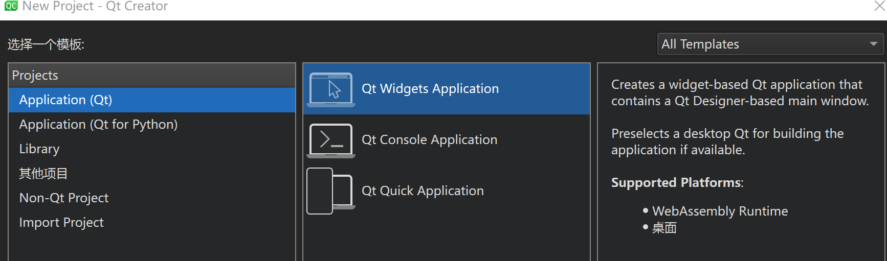

### 1、QT介绍

#### QT简介

QT是一个强大的、开源的图形用户界面（GUI）工具包，由Qtopia项目发展而来，最初由Qtopia软件公司开发，现在由Qt Software公司维护和开发。Qt支持多种操作系统，包括Windows、Linux、Mac OS X和Android等。 Qt具有以下特点：

- 跨平台性：Qt可以在多种操作系统和设备上运行，包括桌面系统、移动设备和嵌入式设备。
- 高性能：Qt采用了先进的图形渲染技术，可以实现高性能的图形用户界面。
- 可扩展性：Qt提供了丰富的API和工具，可以方便地扩展应用程序的功能。
- 可维护性：Qt具有良好的可维护性，可以方便地处理各种软件问题和需求变更。
- 开源性：Qt是开源软件，可以自由地使用、修改和发布。

Qt的应用领域包括：

- 商业应用：Qt可用于开发各种商业应用程序，包括桌面应用、移动应用和Web应用。 *嵌入式应用：Qt可用于开发各种嵌入式应用，包括汽车电子、医疗设备、工业控制和家电等。
- 游戏开发：Qt可用于开发2D和3D游戏，支持多种游戏引擎和渲染技术。
- 教育应用：Qt可用于开发各种教育应用，包括学习工具、教学软件和多媒体教室等。

#### Qt的跨平台开发能力

Qt具有强大的跨平台开发能力，可以在多种操作系统和设备上运行，包括Windows、Linux、Mac OS X和Android等。Qt通过使用Qt库和Qt框架，实现了跨平台的统一开发模型，使开发人员可以使用相同的代码和工具在不同平台上开发应用程序。 Qt库提供了一组通用的API，用于创建图形用户界面和处理用户交互。Qt库支持多种渲染引擎，包括Qt Quick、Qt Quick 2、Qt Style Sheets和Qt SVG等，可以根据不同平台和设备选择合适的渲染引擎。 Qt框架提供了一组跨平台的核心功能，包括窗口系统、事件处理、文件系统、网络通信、多媒体支持等。Qt框架通过使用Qt Quick、Qt Quick 2、Qt Style Sheets和Qt SVG等技术，实现了跨平台的统一开发模型。 Qt还提供了一组丰富的工具，包括Qt Designer、Qt Creator、Qt Script等，用于快速开发应用程序和界面。Qt Designer可以用于创建和编辑应用程序的用户界面，Qt Creator可以用于编写和调试应用程序代码，Qt Script可以用于创建自动化脚本和机器学习算法等。

#### Qt 开源许可

Qt Software公司提供了两种不同的许可类型，用于授权Qt软件的使用：

1. Qt Professional License：适用于商业应用程序开发，提供了完整的Qt功能和技术支持。Qt Professional License的授权方式是按照每个开发人员的数量进行授权，每个开发人员需要单独授权。Qt Professional License的授权费用根据所选定的授权期限和授权数量而定。
2. Qt Enterprise License：适用于商业应用程序开发和嵌入式设备应用程序开发，提供了完整的Qt功能和技术支持。Qt Enterprise License的授权方式是按照每个设备或每个应用程序进行授权，每个设备或应用程序需要单独授权。Qt Enterprise License的授权费用根据所选定的授权期限和授权数量而定。

此外，Qt还提供了免费的个人开发许可证，适用于个人和非商业用途的应用程序开发。Qt个人开发许可证不提供技术支持和商业应用程序的授权，但可以免费使用Qt库和Qt框架的全部功能。Qt个人开发许可证的授权方式是按照每个开发人员的数量进行授权，每个开发人员需要单独授权。Qt个人开发许可证的授权费用为零。


### 2、QT安装


对于学习QT来说，直接安装最新版就行，可以是体验学习最新功能。

Qt Software公司目前正在维护和开发的Qt版本是Qt 6.3，该版本是Qt 6的最新稳定版本。Qt 6.3包含了许多新特性和改进，例如：

- 新的Qt Quick 2.5.1模块，提供了更多的功能和API。
- 新的Qt Quick CSS 2.5.1模块，提供了更多的CSS3支持。
- 新的Qt Quick Test 1.5.1模块，提供了更多的自动化测试工具。
- 新的Qt Creator 6.3 IDE，提供了更多的开发工具和功能。
- 新的Qt Platform Plugins 6.3模块，提供了更多的平台插件支持。

此外，Qt还提供了许多其他版本，例如Qt 6.2.1、Qt 6.1.2等，可以根据自己的需求选择适合的版本。Qt Software公司还提供了免费的个人开发许可证，适用于个人和非商业用途的应用程序开发。Qt个人开发许可证不提供技术支持和商业应用程序的授权，但可以免费使用Qt库和Qt框架的全部功能。


以下是在Windows操作系统上安装Qt的步骤：

1. 下载Qt安装包：访问Qt官方网站（https://www.qt.io/download/），选择适合自己操作系统的Qt安装包，例如“Qt 5.15.2 for Windows x86-64”。
2. 运行安装包：双击下载的Qt安装包，按照提示进行安装。
3. 选择安装选项：在安装过程中，可以选择安装Qt库、Qt框架、Qt Designer、Qt Creator等不同组件。如果需要使用Qt Creator进行开发，建议选择安装Qt Creator。
4. 安装完成：安装完成后，可以在开始菜单中找到Qt相关的应用程序，例如Qt Creator、Qt Designer等。

### 3、Hello Word

入门一个新的开发平台，第一步就是先把他跑起来，我们看一下一个经典的hello word。

使用Qt开发一个显示“Hello Qt”的应用程序，主要有以下步骤：

1. 打开Qt Creator：打开Qt Creator软件，选择“新建”->“应用程序”，然后选择“Qt Quick应用程序”模板。
2. 设计用户界面：在Qt Creator的工具栏中选择“设计”模式，使用Qt Quick Designer工具设计用户界面。在设计好的用户界面中，添加一个文本框，用于显示“Hello Qt”。
3. 编写代码：在Qt Creator的工具栏中选择“代码”模式，打开应用程序的源代码文件。在文件中添加以下代码：

```
cCopy code#include <QApplication>
#include <QLabel>

int main(int argc, char *argv[])
{
    QApplication a(argc, argv);

    QLabel label("Hello Qt");

    return a.exec();
}
```

这段代码使用QApplication类创建应用程序，并使用QLabel类创建一个文本框，用于显示“Hello Qt”。

运行应用程序：保存源代码文件并运行应用程序。在Qt Creator的工具栏中选择“运行”按钮，或者按下F9键，运行应用程序。应用程序将显示一个文本框，显示“Hello Qt”。




在Qt Creator中创建新应用时，可以选择以下三个模式：

1. Qt Quick应用程序：使用Qt Quick技术创建一个应用程序，可以快速开发高性能的用户界面。Qt Quick是一个基于Qt库的高性能渲染引擎，可以使用XML语法定义用户界面，并且可以在多种平台上运行。使用Qt Quick应用程序模板可以快速创建一个基于Qt Quick的应用程序，并且可以使用Qt Designer和Qt Creator的代码编辑器来编辑应用程序的用户界面和代码。
2. Qt Quick模板应用程序：使用Qt Quick模板创建一个应用程序，可以快速开发一些常见的应用程序模板。Qt Quick模板应用程序模板提供了一些预定义的模板，例如电子表格、日历、图库等，可以直接使用这些模板来创建应用程序，可以节省开发时间和精力。
3. Qt Quick小应用程序：使用Qt Quick小应用程序模板创建一个应用程序，可以快速开发一些小型的、简单的应用程序。Qt Quick小应用程序模板提供了一些预定义的小应用程序模板，例如计时器、时钟、记事本等，可以直接使用这些模板来创建应用程序，可以节省开发时间和精力。


在Qt开发中，可以使用Qmake或Cmake来构建和管理应用程序。 Qmake是Qt Software公司开发的一种编译工具，用于构建和管理Qt应用程序。Qmake使用Qt库和Qt Designer来生成编译所需的Makefile文件，可以自动处理Qt库和Qt Designer文件之间的依赖关系，使得编译过程更加简单和方便。Qmake可以用于构建Qt应用程序的所有阶段，包括编译、链接和安装等。 Cmake是一种跨平台的编译工具，用于构建和管理C/C++应用程序。Cmake使用一种高级语言来描述编译规则和依赖关系，可以自动处理编译器、链接器、库文件等的依赖关系，使得编译过程更加简单和方便。Cmake可以用于构建C/C++应用程序的所有阶段，包括编译、链接和安装等。 在Qt开发中，如果需要使用Qt库和Qt Designer来构建应用程序，可以使用Qmake；如果需要使用C/C++库和工具来构建应用程序，可以使用Cmake。因此，可以根据自己的需求和经验选择适合的工具来构建和管理应用程序。

### 4、QT框架
####4.1 QT框架中常用的一些模块
QTcore是一个基础模块，提供了QT框架的基本功能，如内存管理、线程支持、时间管理、随机数生成等。它还包含了QObject、QCoreApplication、QEvent等类，用于创建和处理应用程序的基本对象和事件。QTcore是QT框架的基础，所有的其他模块都需要依赖QTcore。
QTgui是一个用于处理图形用户界面功能的模块。它提供了各种图形组件，如按钮、文本框、复选框等，以及一个用于创建自定义控件的接口。QTgui是QT框架中用于处理图形用户界面功能的模块
QML（Qt Quick）：QML是一个用于创建交互式应用程序的编程语言，它提供了一种简单的方式来创建和管理图形用户界面。QML是Qt的跨平台语言，可以在Qt的各种平台上运行。
Qt Widgets：Qt Widgets是一个用于创建桌面应用程序的组件库，它提供了基本的GUI组件，如按钮、文本框、复选框等。Qt Widgets与QML一起用于创建应用程序的图形用户界面。
Qt Charts：Qt Charts是一个用于创建图表的组件库，它提供了各种图表类型，如折线图、柱状图、饼图等。Qt Charts可以用于创建图表性的数据可视化。
Qt Data Visualization：Qt Data Visualization是一个用于创建数据可视化的组件库，它提供了各种图表和图表组件，如散点图、柱状图、饼图等。Qt Data Visualization可以用于创建图表性的数据可视化。
Qt Network：Qt Network是一个用于处理网络通信的组件库，它提供了各种网络操作，如创建TCP/IP连接、发送和接收数据等。Qt Network可以用于创建网络应用程序。
Qt SQL：Qt SQL是一个用于处理数据库操作的组件库，它提供了各种数据库连接和操作，如创建表、插入数据、查询数据等。Qt SQL可以用于创建数据库应用程序。
Qt WebEngine：Qt WebEngine是一个用于创建Web浏览器应用程序的组件库。它提供了HTML、CSS和JavaScript引擎，用于渲染和显示Web内容。Qt WebEngine可以用于创建跨平台Web应用程序。
Qt Positioning：Qt Positioning是一个用于获取设备位置信息的组件库。它提供了用于定位的QGeoLocation类，用于获取当前位置、提供位置更新等。Qt Positioning可以用于创建定位应用程序。
Qt Quick Controls 2：Qt Quick Controls 2是一个用于创建快速、响应式和自定义控件的组件库。它提供了许多预定义的控件，如按钮、文本框、复选框等，以及一个用于创建自定义控件的接口。Qt Quick Controls 2可以用于创建具有自定义风格的图形用户界面。
Qt Quick Controls 1：Qt Quick Controls 1是一个用于创建快速、响应式和自定义控件的组件库。它提供了与Qt Quick 1兼容的控件，以及一个用于创建自定义控件的接口。Qt Quick Controls 1可以用于创建具有自定义风格的图形用户界面。

####4.2 QT框架中的一些全局定义
qglobal.h：包含了一些全局定义
比如：

QT_VERSION：表示QT的版本号，例如QT_VERSION(5, 14, 2)。
Qt::Alignment：表示对齐方式，例如Qt::AlignLeft。
Qt::ButtonRole：表示按钮角色，例如Qt::ButtonRole::AcceptRole。
Qt::CheckState：表示复选框状态，例如Qt::CheckState::Checked。
Qt::ConnectionType：表示连接类型，例如Qt::ConnectionType::Auto。
Qt::DateFormat：表示日期格式，例如Qt::DateFormat::ISO8601。
Qt::Key：表示键盘键，例如Qt::Key::Key_A。
Qt::Modifier：表示键盘修饰符，例如Qt::Modifier::ShiftModifier。
Qt::Orientation：表示方向，例如Qt::Orientation::Horizontal。
Qt::Permission：表示权限，例如Qt::Permission::WriteUser。
Qt::ScrollBarPolicy：表示滚动条策略，例如Qt::ScrollBarPolicy::ScrollBarAsNeeded。
Qt::TextInteractionFlag：表示文本交互标志，例如Qt::TextInteractionFlag::NoTextInteraction。

在QTglobal.h中，有一些常用的全局函数，例如：

qint64 qrand()：生成一个随机数。
qint64 qsrand(qint64 seed)：设置随机数种子。
QString QLocale::language()：获取当前语言。
QString QLocale::country()：获取当前国家。
QString QLocale::encoding()：获取当前编码。
qint64 QDateTime::currentDateTime().toMSecsSinceEpoch()：获取当前日期时间的毫秒数。
QDateTime QDateTime::fromMSecsSinceEpoch(qint64 msecsSinceEpoch)：将毫秒数转换为QDateTime对象。
QString QDateTime::toPythonString()：将QDateTime对象转换为Python字符串。
QDateTime QDateTime::fromPythonString(const QString &str))：将Python字符串转换为QDateTime对象。

####4.3 QT的元对象系统
QT的元对象系统（Meta Object System，MOS）是一种用于处理QObject类的元数据和运行时信息的机制。它提供了动态地创建、查询和销毁QObject子类的接口，使得QT框架可以更好地适应不同的需求和提高代码的可维护性。

QT的元对象系统主要包含以下几个部分：

QMetaObject：这是一个基类，用于表示所有类的元对象。它包含了类的元数据，如名称、信号、槽函数、属性等。
QObject：这是一个基类，表示所有类的基类。它实现了QMetaObject。
QMetaType：这是一个类，用于处理QVariant类型的元数据。
QMetaProperty：这是一个类，用于表示类的属性。
QMetaMethod：这是一个类，用于表示类的槽函数。
QSignal：这是一个类，用于表示信号。
QSlot：这是一个类，用于表示槽函数。
QT的元对象系统提供了丰富的接口，用于处理QObject类的元数据和运行时信息。以下是一个简单的例子，展示了如何使用元对象系统：

```
#include <QObject>
#include <QMetaObject>
#include <QDebug>

class MyClass : public QObject
{
   Q_OBJECT

public:
   MyClass() {
       qDebug() << "Constructor called";
   }

   ~MyClass() {
       qDebug() << "Destructor called";
   }

public slots:
   void mySlot() {
       qDebug() << "mySlot() called";
   }
};

int main() {
   MyClass obj;

   // 获取MyClass的元对象
   QMetaObject metaObj = obj.metaObject();

   // 获取类的名称
   qDebug() << "Class name: " << metaObj.className();

   // 获取构造函数
   QMetaMethod constructor = metaObj.constructor(0);
   qDebug() << "Constructor: " << constructor.signature();

   // 获取析构函数
   QMetaMethod destructor = metaObj.method("destructor");
   qDebug() << "Destructor: " << destructor.signature();

   // 获取mySlot()槽函数
   QMetaMethod slot = metaObj.method("mySlot()");
   qDebug() << "mySlot(): " << slot.signature();

   return 0;
}
```

这个例子展示了如何使用QT的元对象系统获取类的基本信息，例如名称、构造函数、析构函数和槽函数。通过元对象系统，QT可以更好地管理和处理QObject类的元数据和运行时信息，提高代码的可维护性和可扩展性。


