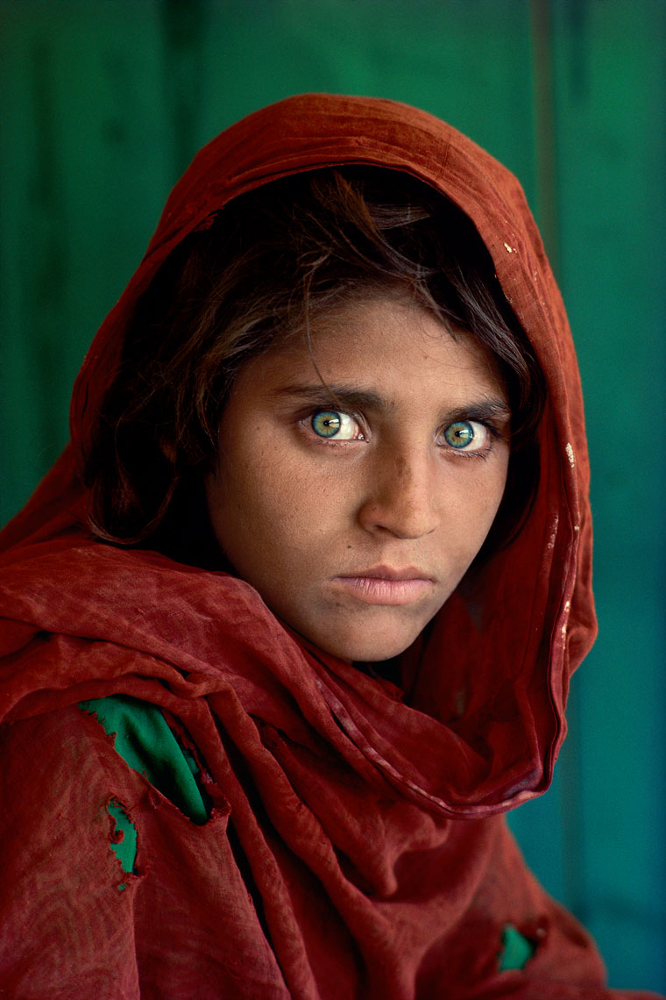

本篇博客用于记录我喜欢的一些跟摄影相关的一些资料，比如电影、摄影资料、摄影师作品网站等。

------------------




#### 摄影师

##### 安德烈·古斯基 Andreas Gursky

1955年出生于德国莱比锡，毕业于德国杜塞尔多夫美术学院，杜塞尔多夫美术学院教授。上世纪80年代，古斯基师从德国摄影大师贝歇夫妇以高角度、大尺幅的景观建筑照片闻名，其作品价格多次打破世界摄影拍卖纪录，至今仍是世界摄影作品最高价格纪录保持者。

古尔斯基作品网站：[www.andreasgursky.com](http://www.andreasgursky.com) 

##### 王庆松

1963年出生于中国黑龙江省哈尔滨市。他以摄影作品和装置作品而闻名，被誉为中国当代摄影艺术家。

王庆松的摄影作品具有独特的视角和风格，展现了他对现实世界的独特理解和思考。他的作品涵盖了城市景观、自然风光、人物肖像等多个领域，其中以对城市景观的拍摄最为著名。

王庆松的摄影作品注重对细节的刻画和表现，同时运用了大量的数字处理技术，使得作品更加完美和具有艺术性。

除了摄影作品，王庆松还涉足装置艺术领域。他的装置作品以独特的创意和表现形式而著称，将摄影、装置和艺术相结合，展现了他对现实世界的独特理解和思考。

 王庆松作品: https://wangqingsong.artron.net/

##### 乔·麦克纳利

乔·麦克纳利是世界著名摄影大师，“百名对摄影最具影响力的人”之一。他也是柯达公司“在线传奇人物”和尼康公司“镜头背后的传奇人物”。

乔的客户包括《体育画报》、《ESPN》、《国家地理》、《生活》、《时代周刊》、《财富》、《纽约时报杂志》、《商业周刊》、《滚石》等畅销杂志，以及纽约证券交易所、美国Target连锁超市、索尼、通用电气和PNC银行等著名公司和机构。

乔的摄影作品以震撼的视觉效果和独特的风格而闻名，他的作品涵盖了自然、城市、肖像等多个领域，其中以对自然景观的拍摄最为著名。

乔不仅是一位优秀的摄影师，还是一位资深的摄影教育家。他编写了多本摄影教程书籍，并创立了乔·麦克纳利摄影学校，致力于传授他的经验和技巧，帮助更多的人发掘和发挥自己的摄影潜能。

乔·麦克纳利作品官网：https://portfolio.joemcnally.com 

##### 马丁·帕尔

马丁·帕尔是一位英国摄影师，他的作品以独特的视角和风格而著称。

他的作品涵盖了自然、城市、人物等多个领域，其中以对城市景观的拍摄最为著名。

马丁·帕尔的作品注重对细节的刻画和表现，同时运用了大量的数字处理技术，使得作品更加完美和具有艺术性。

除了摄影作品，马丁·帕尔还涉足装置艺术领域。他的装置作品以独特的创意和表现形式而著称，将摄影、装置和艺术相结合，展现了他对现实世界的独特理解和思考

马丁帕尔作品官网 ：

https://www.martinparr.com

##### Phil Borges

Phil Borges是一位美国摄影师，他的作品以肖像摄影为主，以独特的视角和风格而著称。

他的肖像摄影作品注重对人物个性和情感的刻画，通过细腻的构图和用光来展现人物的情感和特点。

Phil Borges的摄影作品涵盖了多个领域，包括人物肖像、自然风光、城市景观等。
总的来说，Phil Borges是一位充满创造力和想象力的摄影师，他的作品展现了现实世界的美好与壮丽，同时也展现了他对于艺术和生活的独特理解和追求。

Phil Borges作品网站：http://www.philborges.com/


##### 杉本博司

杉本博司（Hiroshi Sugimoto）是一位日本摄影师，1948年出生于日本东京。他以拍摄静态的、具有仪式感的作品为主，以极简主义风格和概念性摄影而著称。

他的作品包括但不限于以下内容：

1. 概念性摄影：他拍摄的《枪》《水的焰影》等作品，将物体的形式简化到最简单的程度，通过精细的构图和曝光时间来表达出物体的概念和意义。
2. 杉本博司的“剧场”系列：这个系列以舞台和幕布为拍摄对象，强调了戏剧表演中的仪式感和形式感，将剧场作为具有宗教性的场所来表现。
3. 杉本博司的“海景”系列：这个系列以海洋为拍摄对象，通过长时间的曝光时间来捕捉海浪的运动，展现出海洋的神秘和壮美。

总的来说，杉本博司是一位充满创造力和想象力的摄影师，他的作品展现了日本当代摄影和艺术的独特魅力和实力。

杉本博司网站：[Hiroshi Sugimoto (sugimotohiroshi.com)](https://www.sugimotohiroshi.com/)

##### 段岳衡

段岳衡作品集链接:https://pan.baidu.com/s/1zME5OQyv_8f1qceNpm-FUA 密码:i1u7

##### Prince Gyasi

Prince Gyasi作品集链接:https://pan.baidu.com/s/1Zb8yTSW2bVvFfiK1dEOOzg 密码:rf6w

##### Alex Webb

Alex Webb作品集 作品集：https://pan.baidu.com/s/1aQ_Q3gQeAAoWjaki0yLzgA  密码:c36s 视频集：https://pan.baidu.com/s/1Oo1IFIE5GG4KRLHq2CgOVQ  密码:8pik


##### 史蒂夫•麦凯瑞 

史蒂夫•麦凯瑞 作品链接:https://pan.baidu.com/s/1oFKn8CVMKjmPhBavVu1jPw 密码:rqw3 作品网站：https://stevemccurry.com/galleries

##### Ilker Karaman

Ilker Karaman作品官网[www.littleboxcollective.com](http://www.littleboxcollective.com) Ilker Karaman作品下载https://pan.baidu.com/s/1oHXbAdrYjmFVSYE1wIu27A  提取码：ewey 

##### 何藩

作品官网https://fanho-forgetmenot.com 何藩作品下载https://pan.baidu.com/s/1X7pld-Wo7H1lr8SDgm_3Uw?pwd=N74a  提取码：N74a Albins jodin作品官网[www.instagram.com/albinsjodin](http://www.instagram.com/albinsjodin) Albins jodin作品下载链接: https://pan.baidu.com/s/17OnXvebXUlLhRIqUM4J3cw?pwd=9f6o 提取码: 9f6o  《同流者》电影下载链接: https://pan.baidu.com/s/1m3CMbBcQlHm2lpl4kg-Few?pwd=1473 提取码: 1473


##### 吕楠

四部高清作品集 《被遗忘的人》链接:https://pan.baidu.com/s/1Z947xZEidic-qmd0NUgc-A  密码:3ko5 《四季》链接:https://pan.baidu.com/s/1x3idXUEdrmDrB2vK3EVYKQ  密码:n28b 《缅北jian yu》链接:https://pan.baidu.com/s/1itqrSJpTtC-WZiGLG9DTSQ  密码:zqxu 《在路上》链接:https://pan.baidu.com/s/1uw-jvNn9y0k23eR3KUhf3g  密码:ouq7

##### 张克纯

张克纯作品官网：http://zhangkechun.com 上田义彦作品官网： https://www.yoshihikoueda.com

##### 川内伦子

作品链接链接: https://pan.baidu.com/s/1VZ6OuYSRY-bL8WOL_TSvRQ?pwd=1un8 提取码: 1un8

##### jimmymarble

作品网址https://jimmymarble.com 

##### Nick Prideaux

作品网址[www.nickprideaux.com](http://www.nickprideaux.com) 

##### James Perolls

 作品网址[www.perolls.com](http://www.perolls.com) 

##### Evelyn Bencicova

作品网址http://evelynbencicova.com

##### Nguan

作品官网http://nguan.tv 

##### lottiedavies

作品官网[www.lottiedavies.com](http://www.lottiedavies.com) 

##### paolobarrettaph

作品官网[www.paolobarrettaph.com](http://www.paolobarrettaph.com)

##### lottiedavies

作品https://pan.baidu.com/s/1iNSUQewdLNmMcJME9PL27Q?pwd=f4n9 提取码: f4n9

##### 格拉布斯

作品 https://pan.baidu.com/s/1Om4laVYIsLtiVe8tjhbIKA?pwd=27ja 提取码: 27ja

##### Paolo Barretta

作品 https://pan.baidu.com/s/1wZLac1vBIhtlYLTh6in6pg?pwd=q52v 提取码: q52v


##### 古尔斯基

网址[www.andreasgursky.com](http://www.andreasgursky.com) 

古尔斯基作品:https://pan.baidu.com/s/1mlVe4Hai34HufUaJHrPFKg 提取码:7377 

##### Eszter Sarah

作品官网 [www.esztersarah.com](http://www.esztersarah.com) 

##### ELLE-MAY

作品官网[www.elle-may.com](http://www.elle-may.com) 

##### Denisse Ariana Pérez

作品网址[www.denissearianaphotography.com](http://www.denissearianaphotography.com)

##### Denisse Ariana Pérez

作品:https://pan.baidu.com/s/14QNztXxadyfLI-Zjoh343g  密码:ptk3 ELLE-MAY 作品:https://pan.baidu.com/s/1kJnhCKuwTPT1trK_3rdpVg  密码:gvh7

#####  Eszter Sarah

作品链接:https://pan.baidu.com/s/178Ljq1ugx7JU0KtDX6d8YQ  密码:1rmq


#### 纪录片

##### 《地球的夜晚》

链接:https://pan.baidu.com/s/1BHj0mmYpxUp5DMSoLbDsKA  密码:xixj 

##### 《生命之色》

链接:https://pan.baidu.com/s/1GetsM1UKge0Px8ObVFu07Q  密码:4p3p 

##### 《人类星球》

链接:https://pan.baidu.com/s/1OoHI4f0N4dSrzNShPet3bA  密码:sa5o 

##### 《宁静的世界》

链接:https://pan.baidu.com/s/1QOOfa9OoZCrN0dApDmqJTw  密码:ee0v


####  电影

##### 《燃烧女子肖像》

链接:https://pan.baidu.com/s/1MF15XxlDhAD-xQwEcL12EQ  密码:uz5j 

##### 《法兰特派西》

链接:https://pan.baidu.com/s/1mZoiTmiPD5qxPHnLMYGjDQ  密码:gtit 

##### 《银翼杀手》

链接:https://pan.baidu.com/s/1AWnrDorL2ZV8E8e4ceQPdw  密码:kn6c

##### 《降临》

（2016年）：这部电影采用了独特的视角和拍摄手法，将外星人来到地球的故事呈现得非常细腻。

##### 《荒野猎人》

（2015年）：这部电影的摄影非常真实，通过高清的画质和大自然的细节，将人性的挣扎和生存的艰辛展现得淋漓尽致。

##### 《疯狂的麦克斯：狂暴之路》

（2015年）：这部电影通过华丽的视觉效果和独特的拍摄手法，将末日世界中的疯狂和野性表现得非常生动。


\```mermaid

graph LR;
  A-->B;
  B-->C;
  C-->D;
  D-->A;

\```
