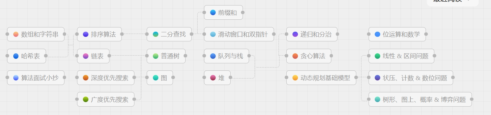

知识地图：



[LeetBook - 力扣（LeetCode）全球极客挚爱的技术成长平台](https://leetcode.cn/leetbook/)


数组和字符串：

[数组和字符串 - LeetBook - 力扣（LeetCode）全球极客挚爱的技术成长平台](https://leetcode.cn/leetbook/read/array-and-string/chg0d/)


集合，列表和数组

集合是个数学概念，表示一些元素组成的一个整体

```c++
class Solution {

public:

  int pivotIndex(vector<int>& nums) {

​    vector<int> sumL(nums.size());

​    vector<int> sumR(nums.size());

​    int tempLeft = 0;

​    int tempRight = 0;

​    for (int i = 0; i < nums.size(); ++i) {

​      tempLeft += nums[i];

​      tempRight += nums[nums.size() - 1 -i];

​      sumL[i] = tempLeft;

​      sumR[nums.size() - 1 - i] = tempRight;

​    }

​    int index = 0;

​    while (index < (nums.size() - 1)) {

​      if (sumL[index] == sumR[index]) {

​        return index;

​      }

​      index++; 

​    }

​    if (sumL[index] == sumR[index]) {

​      return index;

​    }

​    return -1;

  }

};
```


